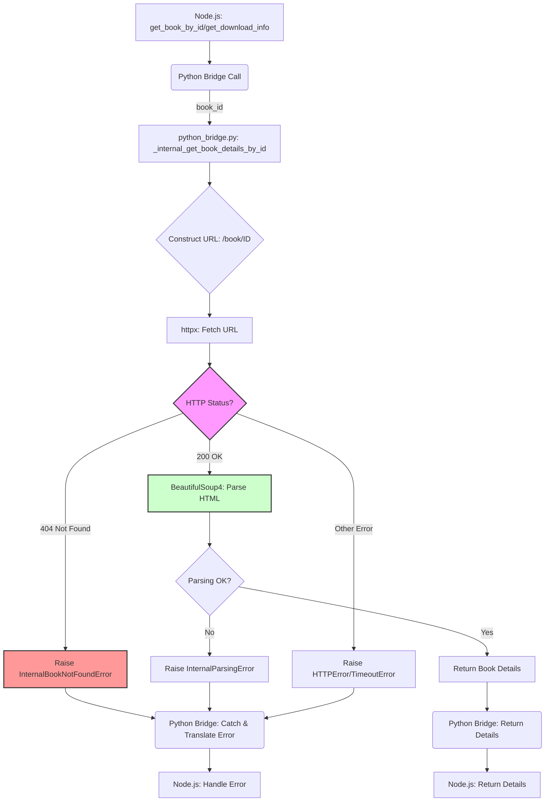

# Architect Specific Memory
<!-- Entries below should be added reverse chronologically (newest first) -->
### Diagram: Internal ID Lookup Flow - [2025-04-16 08:10:00]
- **Description**: Simplified flow for the internal ID lookup implementation via scraping.

**Notes:** Highlights the expected 404 path and the conditional parsing path. Error translation occurs in the bridge.


## System Diagrams
### Diagram: RAG Document Processing Pipeline (v2 - File Output) - [2025-04-23 23:29:31]
- **Description**: Data flow showing RAG workflows, updated to reflect saving processed text to a file and returning the path.
```mermaid
graph TD
    subgraph Agent Workflow
        A[Agent: Search/Select Book] --> B1(Agent: Call download_book_to_file);
        B1 -- process_for_rag=true --> C{zlibrary-mcp Server};
        C -- Result: Orig Path & Processed Path --> E[Agent: Use Processed Path for RAG];

        A --> B2(Agent: Call download_book_to_file);
        B2 -- process_for_rag=false/omitted --> C;
        C -- Result: Orig File Path --> D[Agent: Call process_document_for_rag];
        D --> C;
        C -- Result: Processed File Path --> E;
    end

    subgraph "zlibrary-mcp Server (Node.js)"
        F[MCP Tool: download_book_to_file] --> G[lib/zlibrary-api.js: downloadBookToFile];
        G --> H(Python Bridge Call);
        I[MCP Tool: process_document_for_rag] --> J[lib/zlibrary-api.js: processDocumentForRag];
        J --> H;
        H -- Orig Path & Processed Path --> G; // Updated path for combined flow
        H -- Processed Path --> J; // Updated path for separate flow
    end

    subgraph "Python Bridge (python-bridge.py in Venv)"
        K[Handle download_book] --> L[zlibrary lib: Download];
        L --> M[Save Orig File to Disk];
        M -- If process_for_rag=true --> N[Call Handle process_document internally];
        N --> T[Save Processed Text to File];
        T --> U[Return Orig Path & Processed Path];

        O[Handle process_document] --> P{Detect File Type};
        P -- EPUB --> Q[Use ebooklib];
        P -- TXT --> R[Read Text File];
        P -- PDF --> R_PDF[Use PyMuPDF];
        Q --> S[Get Processed Text];
        R --> S;
        R_PDF --> S;
        S --> T;
        T --> V[Return Processed Path];
    end

    H -- download args (incl. process_flag) --> K;
    H -- process args --> O; // For separate tool call
    U -- orig_path, processed_path --> H;
    V -- processed_path --> H;

    style Agent Workflow fill:#f9f,stroke:#333,stroke-width:2px
    style "zlibrary-mcp Server (Node.js)" fill:#ccf,stroke:#333,stroke-width:2px
    style "Python Bridge (python-bridge.py in Venv)" fill:#cfc,stroke:#333,stroke-width:2px
```
**Notes:** Reflects the change from returning raw text to returning file paths (`processed_file_path`) and the added step of saving the processed text in the Python bridge.


### Diagram: RAG Document Processing Pipeline - [2025-04-14 12:08:15] (Updated)
- **Description**: Data flow showing both combined download/process and separate process workflows for RAG document preparation.
```mermaid
graph TD
    subgraph Agent Workflow
        A[Agent: Search/Select Book] --> B1(Agent: Call download_book_to_file);
        B1 -- process_for_rag=true --> C{zlibrary-mcp Server};
        C -- Result: Path & Text --> E[Agent: Use Text for RAG];

        A --> B2(Agent: Call download_book_to_file);
        B2 -- process_for_rag=false/omitted --> C;
        C -- Result: File Path --> D[Agent: Call process_document_for_rag];
        D --> C;
        C -- Result: Processed Text --> E;
    end

    subgraph "zlibrary-mcp Server (Node.js)"
        F[MCP Tool: download_book_to_file] --> G[lib/zlibrary-api.js: downloadBookToFile];
        G --> H(Python Bridge Call);
        I[MCP Tool: process_document_for_rag] --> J[lib/zlibrary-api.js: processDocumentForRag];
        J --> H;
        H -- Processed Text --> G; // Added path for combined flow
        H -- Processed Text --> J; // Existing path for separate flow
    end

    subgraph "Python Bridge (python-bridge.py in Venv)"
        K[Handle download_book] --> L[zlibrary lib: Download];
        L --> M[Save File to Disk];
        M -- If process_for_rag=true --> N[Call Handle process_document internally];
        N --> S[Return Processed Text];
        O[Handle process_document] --> P{Detect File Type};
        P -- EPUB --> Q[Use ebooklib];
        P -- TXT --> R[Read Text File];
        Q --> S;
        R --> S;
    end

    H -- download args (incl. process_flag) --> K;
    H -- process args --> O; // For separate tool call
    S -- processed text --> H;

    style Agent Workflow fill:#f9f,stroke:#333,stroke-width:2px
    style "zlibrary-mcp Server (Node.js)" fill:#ccf,stroke:#333,stroke-width:2px
    style "Python Bridge (python-bridge.py in Venv)" fill:#cfc,stroke:#333,stroke-width:2px
```
**Notes:** Supports both efficient combined workflow and flexible separate processing. Extensible via Python bridge.


<!-- Append new diagrams using the format below -->

### Diagram: Managed Python Venv for NPM Package - [2025-04-14 03:29:40]
- **Description**: Flowchart illustrating the setup and runtime process for automatically managing a Python virtual environment to ensure reliable execution of `python-bridge.py` with its `zlibrary` dependency when `zlibrary-mcp` is installed globally via NPM.
```mermaid
graph TD
    subgraph Installation/Setup (Post-install/First Run)
        A[NPM Install zlibrary-mcp] --> B{Python 3 Found?};
        B -- Yes --> C{Venv Exists @ Cache Path?};
        B -- No --> D[Fail: Instruct User to Install Python 3];
        C -- No --> E[Create Venv using Found Python 3];
        C -- Yes --> F[Verify Venv Integrity (Optional)];
        E --> G[Install zlibrary via venv pip];
        F --> G;
        G --> H[Store Absolute Path to venv Python];
    end

    subgraph Runtime Execution
        I[zlibrary-mcp needs Python bridge] --> J[Load Stored Venv Python Path];
        J -- Path Found --> K[Configure python-shell/spawn];
        J -- Path Not Found/Invalid --> L[Error: Setup Incomplete? Re-run Setup?];
        K -- pythonPath = venv/bin/python --> M[Execute python-bridge.py];
        M --> N[Python script runs in dedicated venv];
        N -- Accesses zlibrary --> O[Success: Return Result to Node.js];
        N -- Fails --> P[Error: Report Python Error to Node.js];
    end

    H --> J;
```
**Notes:** This approach balances reliability and user experience by automating the Python environment setup required for the `zlibrary` dependency, assuming the user has a base Python 3 installation.

## Data Models
<!-- Append new data models using the format below -->

## Interface Definitions
### Interface Definition: MCP Tool - get_book_by_id - [2025-04-29 15:37:14] (DEPRECATED)
- **Purpose**: ~~Retrieves detailed book information using only a Z-Library book ID.~~
- **Status**: Deprecated due to external website changes making ID-only lookups impossible.
- **Input**: `{ "id": "string" }`
- **Output**: `{ ...book details... }` (No longer reliably functional)
- **Behavior**: ~~Attempts to fetch book details via internal scraping or library calls.~~ Fails due to external limitations.
- **Related**: ADR-003, Decision-DeprecateGetBookByID-01
### Interface Definition: MCP Tool - download_book_to_file - [2025-04-23 23:29:31] (Updated v2)
- **Purpose**: Downloads a specific book file from Z-Library to a local path. Optionally processes the content for RAG simultaneously, saving the result to a separate file.
- **Input**: `{ "id": "string", "format": "string (optional)", "outputDir": "string (optional, default: './downloads')", "process_for_rag": "boolean (optional, default: false)", "processed_output_format": "string (optional, default: 'txt')" }`
- **Output**:
    - If `process_for_rag` is `false` or omitted: `{ "file_path": "string" }` (Path to the original downloaded file)
    - If `process_for_rag` is `true`: `{ "file_path": "string", "processed_file_path": "string" }` (Paths to original download and the processed text file in `./processed_rag_output/`)
- **Behavior**: Calls Python bridge to download the file. If `process_for_rag` is true, the Python bridge also extracts text (EPUB/TXT/PDF), saves it to `./processed_rag_output/<original_name>.processed.txt`, and returns both paths. Handles download, processing, and file saving errors.
- **Security**: Relies on file system write access. Path validation needed.
- **Related**: Pattern-RAGPipeline-FileOutput-01

### Interface Definition: MCP Tool - process_document_for_rag - [2025-04-23 23:29:31] (Updated v2)
- **Purpose**: Allows an agent to request text extraction and processing from a previously downloaded document file, saving the result to a file for RAG purposes.
- **Input**: `{ "file_path": "string", "output_format": "string (optional, default: 'txt')" }` (Absolute path to the document file)
- **Output**: `{ "processed_file_path": "string" }` (Path to the file containing extracted text in `./processed_rag_output/`)
- **Behavior**: Triggers Python-based processing via the bridge (EPUB/TXT/PDF). Saves extracted text to `./processed_rag_output/<original_name>.processed.txt`. Returns the path to the saved file. Handles file not found, processing errors, and file saving errors.
- **Security**: Relies on file system access. Input path validation needed.
- **Related**: Pattern-RAGPipeline-FileOutput-01


### Interface Definition: MCP Tool - download_book_to_file - [2025-04-14 12:08:50] (Updated)
- **Purpose**: Downloads a specific book file from Z-Library to a local path. Optionally processes the content for RAG simultaneously.
- **Input**: `{ "book_id": "string", "download_path": "string", "process_for_rag": "boolean (optional, default: false)" }`
- **Output**:
    - If `process_for_rag` is `false` or omitted: `{ "file_path": "string" }`
    - If `process_for_rag` is `true`: `{ "file_path": "string", "processed_text": "string" }`
- **Behavior**: Calls Python bridge to download the file. If `process_for_rag` is true, the Python bridge also extracts and processes text (EPUB/TXT) before returning both path and text. Handles download errors and processing errors.
- **Security**: Relies on file system write access. Path validation needed.

### Interface Definition: MCP Tool - process_document_for_rag - [2025-04-14 12:08:50] (Unchanged from [2025-04-14 11:43:00])
- **Purpose**: Allows an agent to request text extraction and processing from a previously downloaded document file for RAG purposes.
- **Input**: `{ "file_path": "string" }` (Absolute path to the document file)
- **Output**: `{ "processed_text": "string" }` (Extracted and processed plain text content)
- **Behavior**: Triggers Python-based processing via the bridge. Supports EPUB and TXT initially. Returns extracted text. Handles file not found or processing errors.
- **Security**: Relies on file system access granted to the server process. Input path validation might be needed.
<!-- Append new interface definitions using the format below -->

## Component Specifications
### Component Specification: RAG Document Processor (Python) - [2025-04-23 23:29:31] (Updated v2)
- **Responsibility**: Handles book download via `zlibrary` lib. Detects file type (EPUB, TXT, PDF), extracts text content using appropriate libraries, performs basic cleaning, **saves the processed text to a file in `./processed_rag_output/`**, and returns the path to the saved file (or original path + processed path for combined download).
- **Location**: `lib/python-bridge.py` (updated `process_document` function, new `_save_processed_text` helper function)
- **Dependencies**: Python 3, `zlibrary`, `ebooklib`, `beautifulsoup4`, `lxml`, `PyMuPDF`. Called by Node.js bridge.
- **Interfaces Exposed**: Internal functions callable via the Node.js-Python bridge mechanism.
    - Download function: Takes book ID, path, process flag, output format. Returns original path and optionally processed file path.
    - Process function: Takes file path, output format. Returns processed file path.
- **Internal Structure**: Download function calls `zlibrary`. If processing requested, calls internal process function. Process function uses conditional logic for extraction, then calls `_save_processed_text` helper to write the result to disk using the standard convention. Handles extraction and saving errors.
- **Related**: Pattern-RAGPipeline-FileOutput-01, Decision-RAGOutputFile-01


### Component Specification: Internal ID Scraper (Python) - [2025-04-16 08:10:00]
- **Responsibility**: Attempts to fetch and parse a Z-Library book page using only the book ID via direct URL construction (`/book/ID`). Primarily responsible for handling the expected 404 error gracefully. If a page *is* fetched successfully, parses metadata and download links.
- **Location**: `lib/python_bridge.py` (new function `_internal_get_book_details_by_id`)
- **Dependencies**: Python 3, `httpx`, `beautifulsoup4`, `lxml`. Called by modified `get_book_by_id`/`get_download_info` in the same file.
- **Interfaces Exposed**: Internal async function `_internal_get_book_details_by_id(book_id: str, domain: str) -> dict`. Raises `InternalBookNotFoundError` on 404, `InternalParsingError` on parsing issues, or standard `httpx` errors.
- **Internal Structure**: Constructs URL, uses `httpx.AsyncClient` to GET URL with headers/timeout/redirects. Checks status code: 404 raises specific error. 200 triggers `BeautifulSoup` parsing based on hypothetical selectors (needs verification if 200 ever occurs). Other errors raise exceptions.
- **Related**: Pattern-InternalIDScraper-01, Decision-InternalIDLookupURL-01


### Component Specification: RAG Document Processor (Python) - [2025-04-14 13:50:00] (Updated)
- **Responsibility**: Handles book download via `zlibrary` lib. Detects file type (EPUB, TXT, **PDF**), extracts text content using appropriate libraries, performs basic cleaning/formatting, returns plain text. Can be called during download (if `process_for_rag` flag is set) or separately. Handles specific errors like encrypted PDFs or image-only PDFs.
- **Location**: `lib/python-bridge.py` (updated `process_document` function, new `_process_pdf` helper function)
- **Dependencies**: Python 3, `zlibrary`, `ebooklib` (for EPUB), `beautifulsoup4`, `lxml`, **`PyMuPDF`** (for PDF). Called by Node.js bridge.
- **Interfaces Exposed**: Internal functions callable via the Node.js-Python bridge mechanism.
    - Download function: Takes book ID, path, process flag. Returns path and optionally processed text.
    - Process function: Takes file path. Returns processed text or specific error message (e.g., encrypted, no text layer).
- **Internal Structure**: Download function calls `zlibrary`. If processing requested, calls internal process function. Process function uses conditional logic based on file type (`.epub`, `.txt`, `.pdf`) for extraction. `_process_pdf` uses `fitz` to open PDF, iterates through pages, extracts text, and includes checks for encryption and lack of text content.


### Component Specification: RAG Document Processor (Python) - [2025-04-14 12:08:50] (Updated)
- **Responsibility**: Handles book download via `zlibrary` lib. Detects file type (EPUB, TXT), extracts text content using appropriate libraries, performs basic cleaning/formatting, returns plain text. Can be called during download (if `process_for_rag` flag is set) or separately.
- **Location**: `lib/python-bridge.py` (updated download function, separate processing function)
- **Dependencies**: Python 3, `zlibrary`, `ebooklib` (for EPUB), standard I/O (for TXT). Future: PDF libraries. Called by Node.js bridge.
- **Interfaces Exposed**: Internal functions callable via the Node.js-Python bridge mechanism.
    - Download function: Takes book ID, path, process flag. Returns path and optionally processed text.
    - Process function: Takes file path. Returns processed text.
- **Internal Structure**: Download function calls `zlibrary`. If processing requested, calls internal process function. Process function uses conditional logic based on file type for extraction.

### Component Specification: MCP Tool Handler (Node.js) - [2025-04-14 12:08:50] (Updated)
- **Responsibility**: Expose the `process_document_for_rag` functionality as an MCP tool. Validate input (file path), call the Python bridge via `lib/zlibrary-api.js`, handle the response (processed text), and return it to the agent.
- **Location**: `index.js` (tool registration), `lib/zlibrary-api.js` (bridge call logic)
- **Dependencies**: `@modelcontext/server`, `lib/python-bridge.js`, `lib/zlibrary-api.js`.
- **Interfaces Exposed**: MCP Tool: `process_document_for_rag`.


<!-- Append new component specs using the format below -->